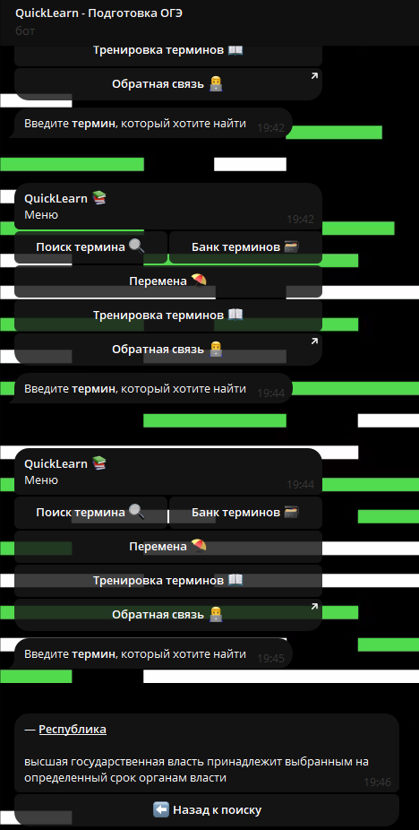

# Quicklearn Python bot - Подготовка к ОГЭ по обществознанию
Бот создан при прохождении [Инженерной лиги Политехнического университета](https://league.spbstu.ru/)

Написан на `Python`, с использование библиотеки `aiogram 2.0` и `sqlite`

Бот имеет возможности:
- Викторина для запоминания терминов
- Мемасы
- Быстрый поиск определений по обществознанию, разделённых по категориям

Фото

